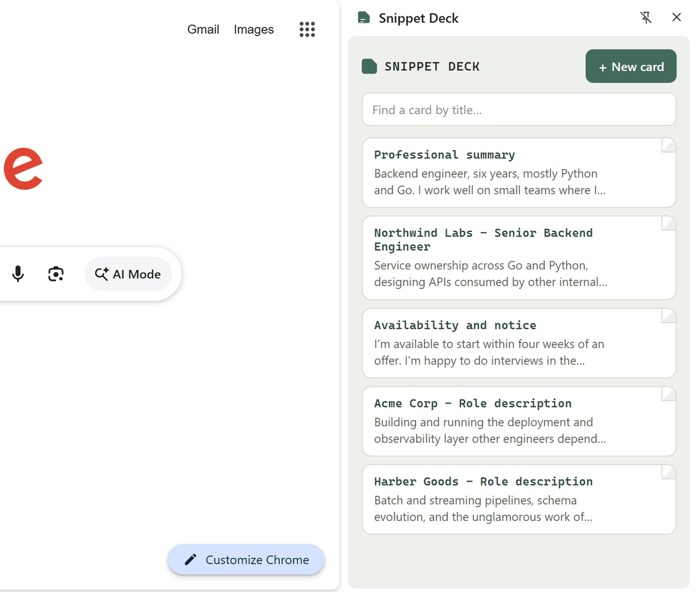

# Snippet Deck

A Chrome extension for job applications: save reusable text blocks (summary,
role descriptions, common short answers) and copy any of them with one click
while filling out a form.

## Install it (unpacked, for personal use)

1. Unzip this folder somewhere permanent. Chrome loads the extension from
   these files, so don't delete or move them after installing.
2. Go to `chrome://extensions`.
3. Turn on **Developer mode** (top-right toggle).
4. Click **Load unpacked** and select the `snippet-deck` folder.
5. Pin it: click the puzzle-piece icon in Chrome's toolbar, then the pin next
   to "Snippet Deck".

## Use it

- Click the toolbar icon to open the panel. It opens as a **side panel**, not
  a popup, so it stays open while you click around the page, with no need
  to reopen it between fields.
- Click **+ New card**, give it a short title (e.g. "Professional summary")
  and paste the text you want to reuse. Save.
- To use a card: click it. The text is copied to your clipboard and you'll
  see a brief "Copied" confirmation. Click into the form field and paste
  (Ctrl/Cmd+V).
- Hover a card and click the pencil icon to edit or delete it.
- Hover a card and drag the grip handle to move it up or down the deck. The
  order is saved. With a card focused you can also hold Alt and press the up
  or down arrow.
- Use the search box at the top to jump to a card by title once you have a
  lot of them.

## Where your data lives

Everything is stored locally on your machine via Chrome's extension storage.
Nothing is sent to any server, and the extension has no access to the
content of the pages you visit (it only ever touches your clipboard, and
only when you click a card).

That also means cards don't currently sync between computers. If you want
that, see the notes below.

## Possible next steps

I kept this to the reliable core: copy-to-clipboard works on every site,
including the React-heavy ones many application portals use (Workday,
Greenhouse, Lever), where a "click to auto-fill the field" approach can
silently fail or need per-site fixes. A few things worth adding if this
sticks:

- **Auto-insert into the focused field**: possible via a content script,
  but needs to handle each site's form framework and will be less reliable
  than copy/paste. Worth trying as an opt-in per card rather than the
  default.
- **Sync across devices**: switch storage from `chrome.storage.local` to
  `chrome.storage.sync`. Trade-off: sync has an ~100KB total / ~8KB per-item
  cap, so it's fine for short answers but not for long attachments of text.
- **Export/import as JSON**: a quick way to back up your cards or move them
  to another machine while sync isn't in place.
- **Categories**: once you have 20+ cards, grouping (e.g. "Contact info",
  "Screening answers") would help on top of manual ordering.
